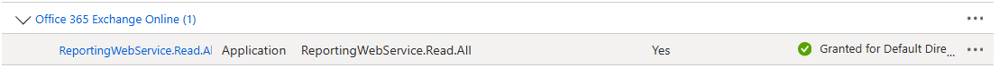
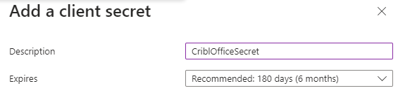

# Office 365 App Registration for Cribl Sources

Complete guide for creating and configuring Azure App Registration to integrate Office 365 services with Cribl Stream.

## 📋 Prerequisites

- Access to Azure Portal with permissions to create App Registrations
- Global Administrator or appropriate Entra ID role
- Exchange Administrator role (for Message Trace configuration)
- PowerShell with ExchangeOnlineManagement module (for Message Trace)

## 🚀 Initial App Registration Setup

### Step 1: Create App Registration

1. From the Azure Portal search for `EntraID` in the top search bar to select 
2. Select  and then 
3. Name your app registration something specific to Cribl (e.g., `Cribl-Stream`) and leave default values in place, then click 

### Step 2: Access API Permissions

4. From the app blade, expand  and select 
5. Click the  button and configure the required permissions based on the Office 365 source you plan to use

## 🔐 Permission Configuration by Source Type

### Office 365 Activity

**Required Permissions:**


1. Find and select 
2. Select 
3. Select the above permissions and click 

### Office 365 Services

**Required Permissions:**


1. Select 
2. Select 
3. Find and select the permissions shown above in the Microsoft Graph section, then click 

### Office 365 Message Trace

**Required Permissions:**



> **Note:** This app permission follows a different assignment path.

1. From the API Permission blade click 
2. Click  and search for `Office 365 Exchange Online`
3. Select 
4. Select 
5. Search for and select the permission shown above
6. Click 

## ✅ Grant Admin Consent and Create Secret

### Grant Admin Consent

1. Before you leave the `API Permissions` blade, click  and then 

### Configure App Secret

2. From the App registration manage blade select 
3. Click 
4. Add a description and expiration timeframe and click , something like this 

> **⚠️ Important:** Take note of the secret value immediately. The secret is only exposed upon creation. This is what you capture for use in the Cribl UI.

## 🔧 Exchange Admin Portal Configuration

**Required for Office 365 Message Trace only**

### Create Role Group

1. Logon to https://admin.exchange.microsoft.com/
2. Expand  and select 
3. Click 
4. Name your role group (e.g., `Cribl-O365MessageTrace`) and click 
5. Search for and select  and , then click 
6. Click  again and then 

## 💻 PowerShell Configuration

**Required for Office 365 Message Trace only**

### Install and Connect

```powershell
Install-Module -Name ExchangeOnlineManagement -Force
Import-Module ExchangeOnlineManagement
Connect-ExchangeOnline
```

### Create Service Principal and Assign Role

```powershell
# Create service principal using the App Registration details
New-ServicePrincipal -DisplayName "<Name of the App>" -AppId <Application (client) ID> -ServiceId <Object ID>

# Add service principal to the role group
Add-RoleGroupMember -Identity "Cribl-O365MessageTrace" -Member <Application (Client) ID>
```

> **Note:** Ensure you use the Object ID of the Enterprise App Service Principal associated with your App Registration.

## 🎯 Best Practices

- **Unique Secrets**: Create a unique secret for each Cribl Office 365 source for better security and least privilege access
- **Secret Rotation**: Set appropriate expiration timeframes and establish a secret rotation schedule
- **Documentation**: Record the Application (client) ID and Tenant ID for Cribl configuration
- **Access Review**: Periodically review assigned permissions and remove unused ones

---

**Need help?** Refer to the [Cribl documentation](https://docs.cribl.io) for Office 365 source configuration details.